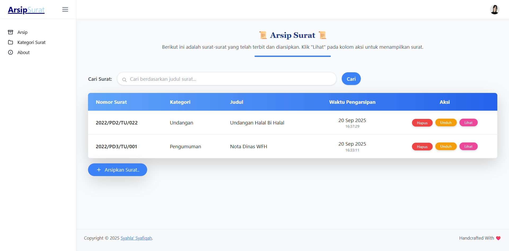
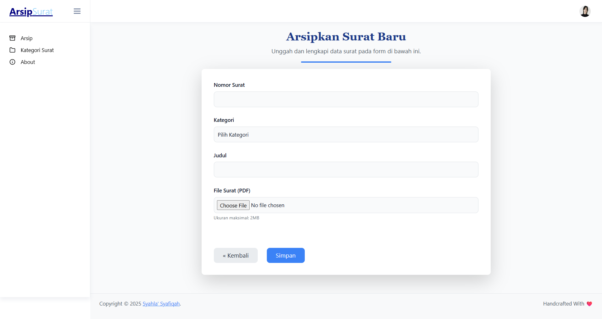
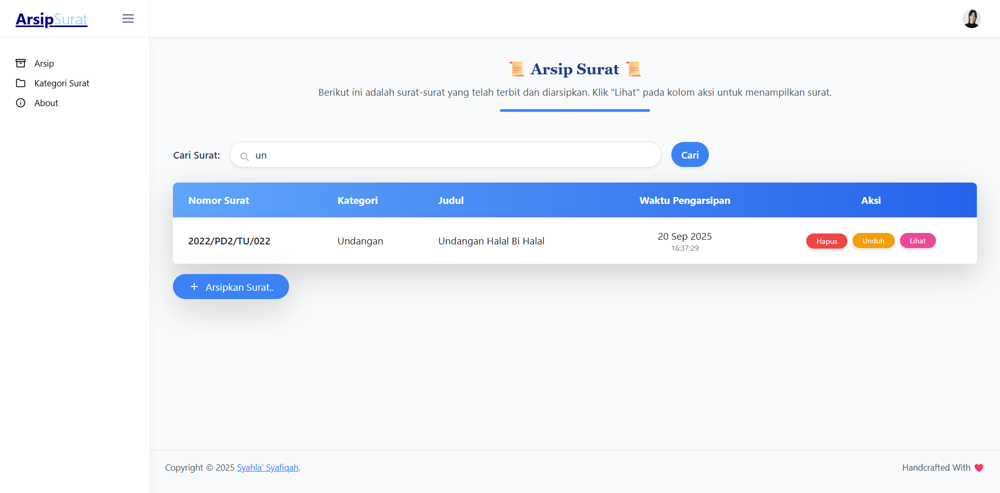
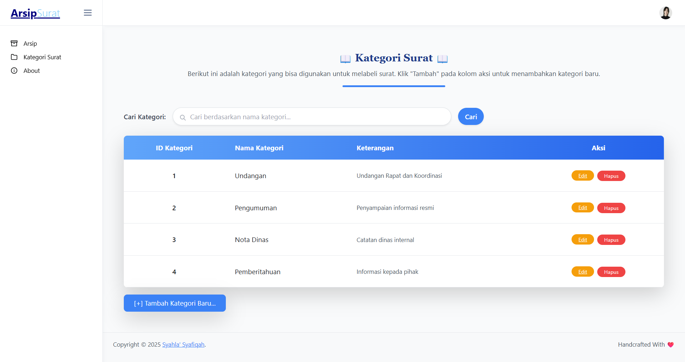
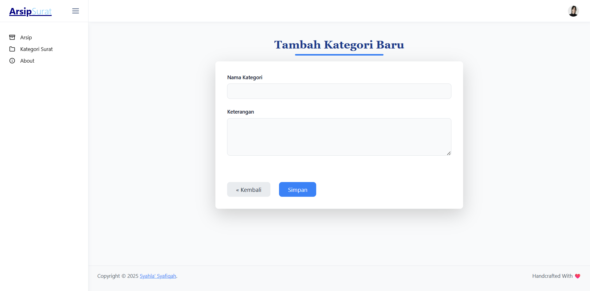
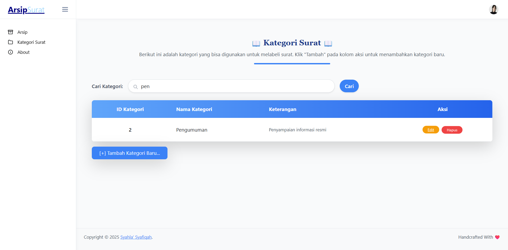
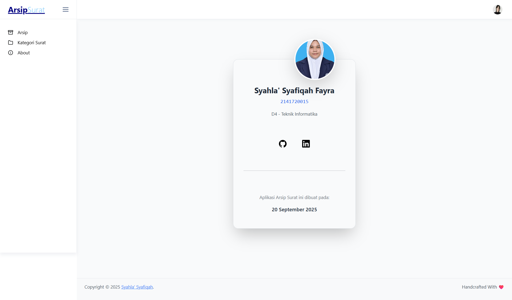

# ARSIP SURAT
    
  

Aplikasi web yang dikembangkan untuk mendukung perangkat Desa Karangduren dalam pengelolaan, penyimpanan, dan pengarsipan surat resmi secara digital dengan lebih efisien dan terstruktur.

</div>

## Tujuan

Aplikasi ini dirancang untuk mengelola arsip surat secara digital, sekaligus memudahkan proses pencarian, pengelompokan, dan penyimpanan surat dengan aman.

## Fitur

- **Manajemen Arsip Surat**: Tambah, edit, hapus, dan lihat arsip surat.
- **Kategori Surat**: Tambah, edit, hapus kategori surat
- **Pencarian Surat**: Cari surat berdasarkan kata kunci.
- **Pencarian Kategori Surat**: Cari kategori surat berdasarkan kata kunci.
- **Upload File**: Simpan file surat dalam format PDF.

## Cara Menjalankan

1. Clone repository ini:
   ```bash
   git clone "https://github.com/syahla31/arsipLSP.git"
   ```
2. Masuk ke direktori proyek:
   ```bash
   cd arsipLSP
   ```
3. Install dependensi menggunakan Composer:
    ```bash
       composer install
       php artisan key:generate
    ```
4. Salin file `.env.example` menjadi `.env` dan sesuaikan konfigurasi database.
5. Jalankan migrasi database atau gunakan file siparsat-kd.sql:
   ```bash
   php artisan migrate --seed
   ```
6. Jalankan aplikasi dengan perintah:
   ```bash
    php artisan serve
    ```
   
## Screenshot
1. Halaman Arsip Surat
   
2. Halaman Tambah Surat
   
3. Halaman Cari Arsip Surat
   
4. Halaman Kategori Surat
   
5. Halaman Tambah Kategori Surat
   
6. Halaman Cari Kategori Surat
   
5. Halaman About
   
